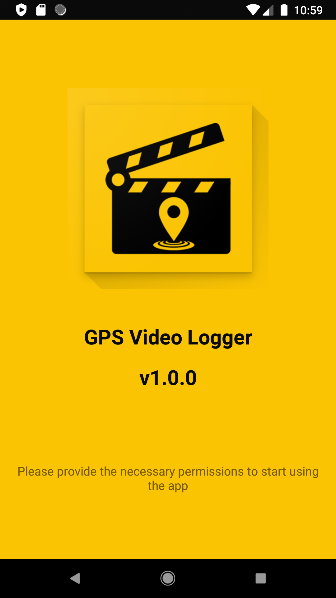
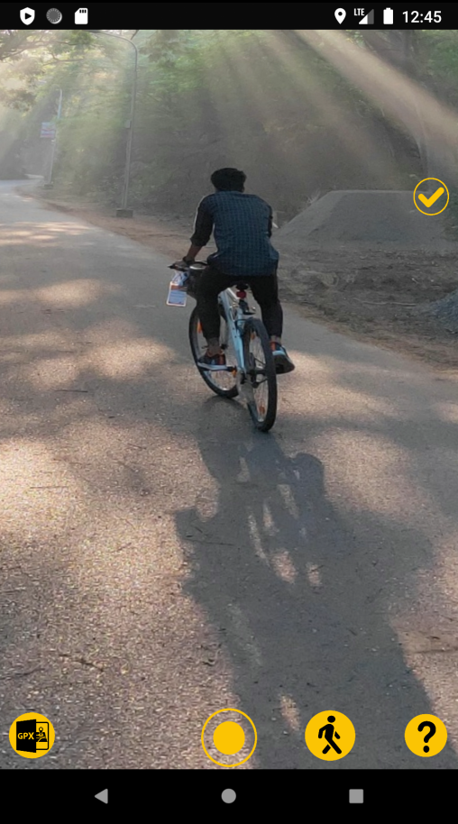
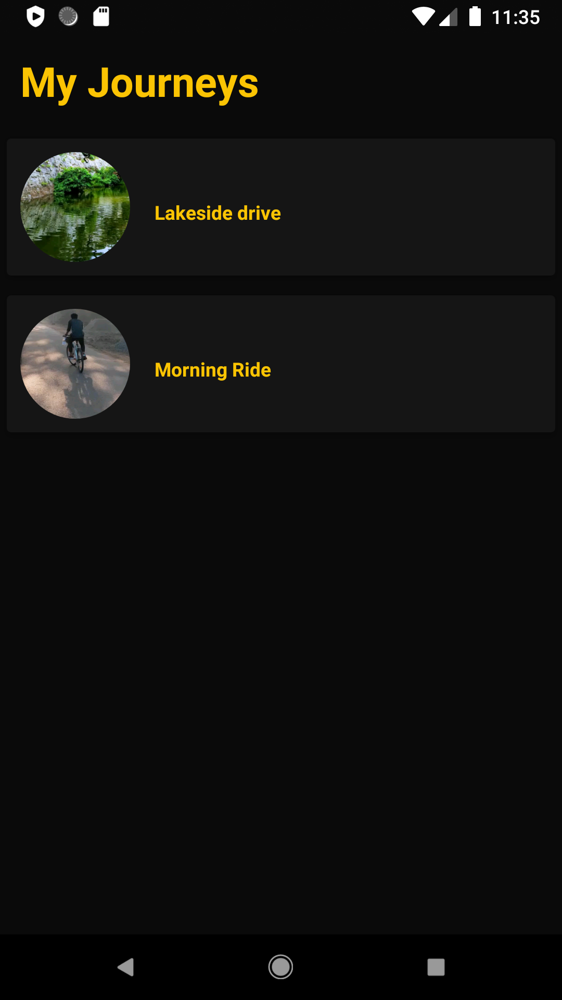
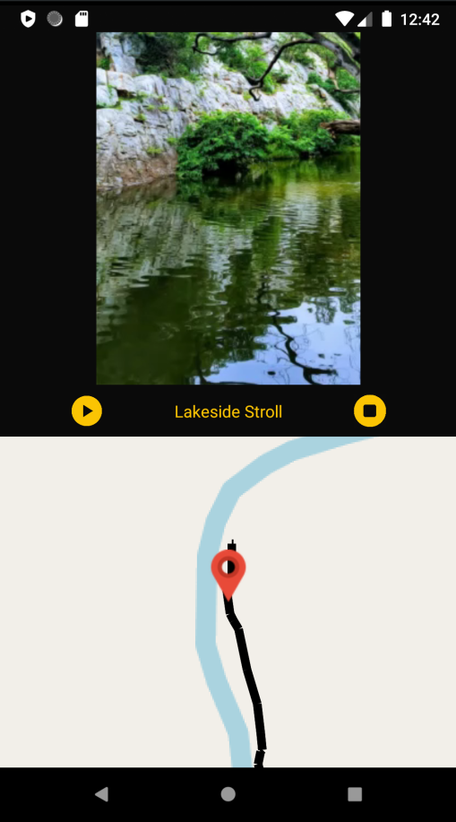

# GPS-Video-Logger 
  
Record and playback video and live location data simultaneously.

   

## Description

GPS Video Logger is a simple Android App to record video and geographical position simultaneously. 
GPS logging and video tracking is done in an optimized manner. 
The app offers two modes of recording. 
A Drive mode for your car/bike rides and a Walk mode for your evening strolls. 
The app provides a video player to view your video and location on map side by side. (Video and GPS player) 
Recorded journeys are stored directly in your Internal Storage (Video as mp4 and track as a GPX file). 
 
The application can be downloaded from this repository.[GPSVideoLogger](https://github.com/abinpaul1/GPS-Video-Logger/blob/master/app/release/app-release.apk) 
It will shortly be made available on Google Play Store.

## Reference documents

[Code of conduct](CODE_OF_CONDUCT.md)

[Repository License](LICENSE)

## Frequently Asked Questions
<b>Q</b> - <i>I've just installed the App, but it doesn't read the GPS Signal.</i> 
<b>A</b> - Please reboot your Device, go in an open Area and try to repeat your test.

<b>Q</b> - <i>How can I backup/copy my Journeys?</i> 
<b>A</b> - You can see your journey files in the GPS_Video_Logger folder in your Internal Storage. Each journey has a video file in mp4 format and track file(location) in GPX format. Both these files will have the same name (name of your journey). Copy both these files to succesfully copy your journey.

<b>Q</b> - <i>My horizontal videos appear vertical during playback</i> 
<b>A</b> - Ensure you have enabled the  "Auto Screen Rotate" feature before starting the recording. 
